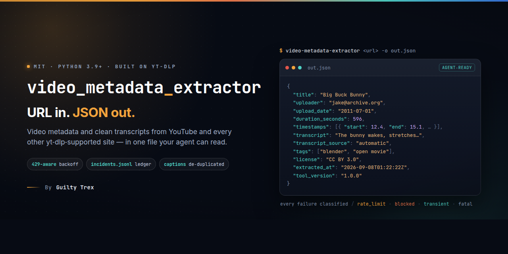

<p align="center">
  
</p>

<h1 align="center">video_metadata_extractor</h1>

<p align="center">
  <b>URL in. JSON out.</b><br>
  Video metadata and clean transcripts from YouTube — and every other yt-dlp-supported site —
  in one agent-friendly JSON file.
</p>

<p align="center"><i>By Guilty Trex</i></p>

<p align="center">
  <a href="https://github.com/theequationagency-dev/agent-video-extract/actions/workflows/ci.yml"></a>
  
  
</p>

---

Point it at a video. Get back one JSON object with the title, uploader, upload date,
duration, tags, chapters, a timestamped caption list and a plain-text transcript.

Two things make it different from a shell script around `yt-dlp`:

1. **Rate limiting is designed in, not bolted on.** Every failure is classified as
   `rate_limit`, `blocked`, `transient` or `fatal`, retried with a budget that matches the
   category, and written to an append-only incident log so you can answer "what actually
   failed?" the next morning.
2. **Captions come out clean.** YouTube's automatic captions roll — each cue repeats the
   previous one with a few words appended. Parsed naively, every sentence lands in your
   transcript three times. This tool merges them.

No account. No API key. No signup. It is a single Python file plus `yt-dlp`.

## Contents

- [Install](#install)
- [Quick start](#quick-start)
- [When the video has captions](#when-the-video-has-captions)
- [Usage](#usage)
- [CLI flags](#cli-flags)
- [Output schema](#output-schema)
- [Use it as a Python library](#use-it-as-a-python-library)
- [Rate limiting and the incident log](#rate-limiting-and-the-incident-log)
- [Troubleshooting](#troubleshooting)
- [Free for anyone, drops into anything](#free-for-anyone-drops-into-anything)
- [Development](#development)
- [Credits](#credits)

## Install

```bash
git clone https://github.com/theequationagency-dev/agent-video-extract.git
cd agent-video-extract
pip install .
```

That gives you the `video-metadata-extractor` command. If you would rather not install
anything, the script runs standalone as long as `yt-dlp` is available:

```bash
pip install -r requirements.txt
python video_metadata_extractor.py --version
```

Requires Python 3.9 or newer.

## Quick start

This example uses a public-domain film from the Internet Archive's Prelinger collection.
Nothing to log into, nothing to configure — it works on a fresh install:

```bash
video-metadata-extractor "https://archive.org/details/wise_use_of_credit" -o out.json
```

Progress goes to stderr, JSON goes to the file:

```
[1/1] https://archive.org/details/wise_use_of_credit
  ok: Wise Use of Credit, The
```

And `out.json` is exactly this:

```json
{
  "title": "Wise Use of Credit, The",
  "source_url": "https://archive.org/details/wise_use_of_credit",
  "uploader": "skipe@mindspring.com",
  "upload_date": "2003-05-28",
  "duration_seconds": 684,
  "tags": [],
  "timestamps": [],
  "transcript": "",
  "license": "http://creativecommons.org/licenses/publicdomain/",
  "extracted_at": "2026-09-08T01:34:30Z",
  "tool_version": "1.0.0",
  "video_id": "wise_use_of_credit",
  "webpage_url": "https://archive.org/details/wise_use_of_credit",
  "description": "0646 PA8673 Wise Use of Credit, The",
  "channel": null,
  "channel_url": null,
  "categories": [],
  "view_count": null,
  "like_count": null,
  "thumbnail": "https://archive.org/download/wise_use_of_credit/wise_use_of_credit.thumbs/wise_use_of_credit_000660.jpg",
  "language": null,
  "extractor": "ArchiveOrg",
  "chapters": [],
  "transcript_source": null,
  "transcript_language": null,
  "error": null
}
```

Leave off `-o` and the JSON goes to stdout, so it pipes:

```bash
video-metadata-extractor "https://archive.org/details/wise_use_of_credit" -q | jq .title
```

That archive item is a 1960 educational film with no caption track, so `transcript` is
empty and `transcript_source` is `null` — that is the honest result, not a failure. Every
key is always present, so agent code never has to guess at the shape.

## When the video has captions

Captioned videos fill in `transcript`, `timestamps`, `transcript_source`
(`"manual"` or `"automatic"`) and `transcript_language`.

Here is the problem this solves. YouTube's automatic captions arrive like this — the same
words repeated across cues, wrapped in inline karaoke timing tags:

```
00:00:01.030 --> 00:00:03.669 align:start position:0%

so<00:00:01.719><c> the</c><00:00:02.199><c> first</c><00:00:02.859><c> thing</c><00:00:03.100><c> is</c>

00:00:03.669 --> 00:00:03.679 align:start position:0%
so the first thing is

00:00:03.679 --> 00:00:06.009 align:start position:0%
so the first thing is
rate<00:00:04.240><c> limiting</c><00:00:04.780><c> hits</c><00:00:05.319><c> everyone</c>
```

Run that through the parser:

```python
from video_metadata_extractor import parse_captions

segments, transcript = parse_captions(open("rolling.vtt", encoding="utf-8").read())
```

and you get each phrase exactly once, with its original timing:

```json
{
  "timestamps": [
    { "start": 1.03,  "end": 3.669, "text": "so the first thing is" },
    { "start": 3.679, "end": 6.009, "text": "rate limiting hits everyone" }
  ],
  "transcript": "so the first thing is rate limiting hits everyone"
}
```

A naive parser gives you *"so the first thing is so the first thing is so the first thing
is rate limiting hits everyone"*. The parser also strips karaoke and styling tags,
unescapes HTML entities, and matches language codes loosely, so `--lang en` accepts
`en-US`, `en-GB` and YouTube's `en-orig`.

## Usage

```bash
# One video
video-metadata-extractor "https://www.youtube.com/watch?v=VIDEO_ID" -o out.json

# Several, one JSON object per line, paced to stay polite
video-metadata-extractor URL_1 URL_2 URL_3 --jsonl --sleep-interval 2 -o out.jsonl

# A list of URLs from a file (blank lines and # comments ignored)
video-metadata-extractor --batch-file urls.txt --jsonl -o out.jsonl

# A whole playlist or channel, capped at the first 25 videos
video-metadata-extractor "https://www.youtube.com/playlist?list=PLxxxx" \
  --playlist --max-entries 25 --jsonl --sleep-interval 3 -o playlist.jsonl

# Spanish captions, falling back to any language the video actually has
video-metadata-extractor URL --lang es,en --any-lang

# Metadata only: no caption download, much faster
video-metadata-extractor URL --no-subs

# Signed-in access for age-gated videos or bot checks
video-metadata-extractor URL --cookies-from-browser firefox
video-metadata-extractor URL --cookies cookies.txt

# Patient mode for a big overnight batch
video-metadata-extractor --batch-file urls.txt --jsonl \
  --retries 8 --base-backoff 5 --max-backoff 900 --sleep-interval 4 -o out.jsonl
```

Output rules, so scripts can rely on them:

| Situation | stdout / `-o` file |
| --- | --- |
| One URL, no `--jsonl` | a single JSON object |
| Several URLs, no `--jsonl` | a JSON array of objects |
| Any number of URLs with `--jsonl` | one JSON object per line, flushed as each URL finishes |

Exit code is `0` when everything succeeded and `1` when anything failed. A failed URL in a
batch never aborts the run: it becomes an error record in place, so record *n* still lines
up with input *n*.

## CLI flags

| Flag | Default | What it does |
| --- | --- | --- |
| `URL` (positional) | — | One or more video URLs. Any [yt-dlp-supported site](https://github.com/yt-dlp/yt-dlp/blob/master/supportedsites.md). |
| `--batch-file PATH` | — | Read URLs from a file, one per line. `-` reads stdin. Blank lines and `#` comments are ignored. |
| `--playlist` | off | Expand playlist and channel URLs into their individual videos. |
| `--playlist-items SPEC` | — | yt-dlp playlist selection, e.g. `1-10` or `1,3,5`. |
| `--max-entries N` | — | Cap how many videos a playlist expands to. |
| `-o`, `--output PATH` | stdout | Write JSON to a file instead of stdout. |
| `--jsonl` | off | One JSON object per line, streamed as each URL finishes. |
| `--indent N` | `2` | Indentation for pretty (non-JSONL) output. `0` for compact. |
| `-q`, `--quiet` | off | Suppress the stderr progress lines. |
| `-v`, `--verbose` | off | Print every retry, its category and its backoff to stderr. |
| `--lang CODES` | `en` | Preferred caption languages, comma separated. Matching is loose: `en` accepts `en-US`. |
| `--any-lang` | off | If none of the preferred languages exist, take whatever the video has. |
| `--no-subs` | off | Skip transcripts entirely. Metadata only, and much faster. |
| `--no-auto-subs` | off | Ignore machine-generated captions; use human-written subtitles only. |
| `--retries N` | `4` | Retries for `rate_limit` and `transient` failures (so 5 attempts total). |
| `--blocked-retries N` | `1` | Retries for `blocked` failures. Deliberately small — a bot check needs credentials, not patience. |
| `--base-backoff SECONDS` | `2.0` | First backoff delay. Doubles each attempt. |
| `--max-backoff SECONDS` | `300.0` | Ceiling on any single backoff wait, and on a server's `Retry-After`. |
| `--sleep-interval SECONDS` | `0.0` | Pause between URLs, to pace a batch. |
| `--socket-timeout SECONDS` | `30.0` | Network timeout handed to yt-dlp. |
| `--cookies PATH` | — | Netscape-format cookies file, passed through to yt-dlp. |
| `--cookies-from-browser BROWSER` | — | Load cookies from a local browser: `BROWSER[+KEYRING][:PROFILE][::CONTAINER]`, e.g. `firefox` or `chrome:Default`. |
| `--proxy URL` | — | HTTP or SOCKS proxy, e.g. `socks5://127.0.0.1:9050`. |
| `--incident-log PATH` | `incidents.jsonl` | Where to append rate-limit / blocked / transient events. |
| `--no-incident-log` | off | Do not write an incident log at all. |
| `--version` | — | Print the tool version and exit. |

## Output schema

Every record has every key. Missing values are `null` (or `[]` / `""`), never absent.

**Core fields — stable, safe to depend on:**

| Field | Type | Notes |
| --- | --- | --- |
| `title` | string | Video title. |
| `source_url` | string | The URL you passed in, unchanged. |
| `uploader` | string | Uploader, falling back to channel or creator. |
| `upload_date` | string | `YYYY-MM-DD`, normalised from yt-dlp's `YYYYMMDD`. |
| `duration_seconds` | int | Whole seconds. |
| `tags` | string[] | Site-provided tags. |
| `timestamps` | object[] | `{ "start": float, "end": float, "text": string }`, seconds from the start. |
| `transcript` | string | The whole transcript as plain text, de-duplicated. |
| `license` | string | Licence name or URL when the site reports one. |
| `extracted_at` | string | ISO 8601 UTC, e.g. `2026-09-08T01:34:30Z`. |
| `tool_version` | string | Version of this tool that produced the record. |

**Additive fields — extra context for agents:**

| Field | Type | Notes |
| --- | --- | --- |
| `video_id` | string | Site-native video id. |
| `webpage_url` | string | Canonical URL as resolved by the extractor. |
| `description` | string | Full description text. |
| `channel` | string | Channel name. |
| `channel_url` | string | Channel or uploader URL. |
| `categories` | string[] | Site categories. |
| `view_count` | int | Views, when reported. |
| `like_count` | int | Likes, when reported. |
| `thumbnail` | string | Thumbnail URL. |
| `language` | string | Language reported by the site. |
| `extractor` | string | Which yt-dlp extractor handled it, e.g. `ArchiveOrg`, `Youtube`. |
| `chapters` | object[] | `{ "start": float, "end": float, "title": string }`. |
| `transcript_source` | string | `"manual"`, `"automatic"` or `null`. |
| `transcript_language` | string | The caption track's actual tag, e.g. `en-US`. |
| `error` | object | `null` on success. On failure: `category`, `message`, `http_status`, `incident_id`, `attempts`, `stage`. |

A failed URL in a batch produces the same shape with `error` filled in and the content
fields empty, so `if record["error"] is None:` is the only check an agent needs.

## Use it as a Python library

```python
from video_metadata_extractor import (
    Config, ExtractionError, extract_video, extract_videos,
)

# One video
record = extract_video("https://archive.org/details/wise_use_of_credit")
print(record["title"], record["duration_seconds"])

# Many, with an explicit policy. Failures come back as error records, not exceptions.
config = Config(
    languages=("en", "es"),
    any_language=True,
    retries=6,
    base_backoff=5.0,
    max_backoff=900.0,
    sleep_interval=2.0,
    incident_log="runs/incidents.jsonl",
)
records, failures = extract_videos(urls, config, on_record=lambda r: print(r["source_url"]))
print(f"{failures} of {len(records)} failed")

# Raising style, if you would rather handle it yourself
try:
    record = extract_video(url, retries=8)
except ExtractionError as exc:
    print(exc.category, exc.http_status, exc.incident_id)
```

Reusable pieces, if you only want one of them:

| Function | Use |
| --- | --- |
| `parse_captions(text)` | WebVTT or SRT text → `(segments, transcript)`, rolling cues merged. |
| `classify_error(exc_or_message)` | → `(category, http_status)`. |
| `compute_backoff(attempt, base, cap, retry_after, jitter)` | Exponential backoff with full jitter. |
| `IncidentLogger(path)` | The append-only JSONL incident log. |
| `Extractor(config, incidents)` | Keeps one yt-dlp session alive across many URLs. |

## Rate limiting and the incident log

Video sites throttle. They also block, break and 404, and those need opposite responses.
Retrying a bot check just gets you noticed; retrying a 429 is exactly right. So every
failure is classified before anything else happens:

| Category | Looks like | What the tool does |
| --- | --- | --- |
| `rate_limit` | HTTP 429, "Too Many Requests", explicit throttling | Retries with exponential backoff and full jitter, honouring `Retry-After`, capped by `--max-backoff`. This is the patient path. |
| `blocked` | "Sign in to confirm you're not a bot", captchas, login walls, members-only, HTTP 401/403 | Retries **once** by default. A bot check is a credentials problem: pass `--cookies` or `--cookies-from-browser` instead of waiting. |
| `transient` | HTTP 5xx, timeouts, reset connections, DNS blips | Same patient backoff as `rate_limit`. |
| `fatal` | Private or removed video, HTTP 404/410, unsupported URL, geo-block, TLS failure | **Never** retried. No amount of waiting fixes a deleted video. |

Backoff is `base × 2^(attempt-1)`, capped at `--max-backoff`, then multiplied by a random
factor between 0 and 1 — full jitter, so a batch of workers that all get throttled at once
does not come back in lockstep. If the server sends a `Retry-After`, that wins outright:
being told beats guessing.

Every `rate_limit`, `blocked` and `transient` event appends one line to
`incidents.jsonl`:

```json
{"timestamp": "2026-09-08T01:34:45Z", "tool": "video-metadata-extractor", "tool_version": "1.0.0", "incident_id": "59cbb9e9fff8", "url": "https://www.youtube.com/watch?v=aqz-KE-bpKQ", "stage": "metadata", "category": "blocked", "http_status": null, "error": "[youtube] aqz-KE-bpKQ: Sign in to confirm you're not a bot. Use --cookies-from-browser or --cookies for the authentication.", "attempt": 1, "max_attempts": 2, "retry_in_seconds": 0.065, "resolved": false}
{"timestamp": "2026-09-08T01:34:46Z", "tool": "video-metadata-extractor", "tool_version": "1.0.0", "incident_id": "59cbb9e9fff8", "url": "https://www.youtube.com/watch?v=aqz-KE-bpKQ", "stage": "metadata", "category": "blocked", "http_status": null, "error": "[youtube] aqz-KE-bpKQ: Sign in to confirm you're not a bot. Use --cookies-from-browser or --cookies for the authentication.", "attempt": 2, "max_attempts": 2, "retry_in_seconds": null, "resolved": false}
```

(That is a real log from running this tool against YouTube from a datacenter IP with no
cookies. The message is truncated here for width; the log keeps it in full.)

The point of the log is the `resolved` field. **When a retry finally succeeds, the tool
writes one more line for the same `incident_id` with `"resolved": true`.** So:

```bash
# Which incidents never recovered? That is your real failure list.
jq -s 'group_by(.incident_id)
       | map(select(all(.[]; .resolved == false)))
       | map(.[0] | {url, category, error})' incidents.jsonl

# How much throttling did last night's batch actually hit?
jq -r 'select(.category == "rate_limit") | .url' incidents.jsonl | sort | uniq -c
```

Fields on every incident line: `timestamp`, `tool`, `tool_version`, `incident_id`, `url`,
`stage` (`metadata`, `subtitles` or `playlist`), `category`, `http_status`, `error`,
`attempt`, `max_attempts`, `retry_in_seconds`, `resolved`.

Fatal failures are not incidents — nothing is going to change — so they show up in the
output record's `error` object and in the exit code, not in the log.

## Troubleshooting

| Symptom | What is happening | Fix |
| --- | --- | --- |
| `Sign in to confirm you're not a bot` | YouTube's bot check. Common from datacenter IPs, VPNs and CI runners. Classified `blocked`, retried once. | `--cookies-from-browser firefox` (or `chrome`, `edge`, `safari`), or export a cookies file and pass `--cookies cookies.txt`. Run from a residential IP where you can. |
| `HTTP Error 429: Too Many Requests` | You are being throttled. Classified `rate_limit` and retried with backoff. | Add `--sleep-interval 3` and raise `--retries`. For big batches: `--base-backoff 5 --max-backoff 900`. Slower is faster than banned. |
| `transcript` is `""` and `transcript_source` is `null` | The video has no caption track in your requested language — or none at all. Not an error. | Add `--any-lang`, or widen with `--lang en,es,fr`. Check `--no-auto-subs` is not on if machine captions are acceptable. |
| `CERTIFICATE_VERIFY_FAILED` | Your Python cannot verify TLS certificates. Classified `fatal`, because retrying will not help. | macOS: run `/Applications/Python 3.x/Install Certificates.command`. Elsewhere: `pip install --upgrade certifi`, and check any corporate proxy's CA bundle is installed. |
| `Private video` / `Video unavailable` | The video is gone or restricted. Classified `fatal`, never retried. | Nothing to do — check the URL. In a batch the record's `error` says so and the run continues. |
| `members-only` / age-gated | A login wall. Classified `blocked`. | Pass cookies from a signed-in browser profile: `--cookies-from-browser chrome:Default`. |
| Everything fails immediately | Usually a stale `yt-dlp`. Sites change; yt-dlp ships fixes weekly. | `pip install --upgrade yt-dlp` |
| Batch is slow | Every URL is a fresh metadata fetch plus a caption download. | `--no-subs` if you only need metadata; drop `--sleep-interval` if the site tolerates it. |

Run with `-v` to see every retry, its category and its backoff as it happens.

## Free for anyone, drops into anything

This is a free tool, for anybody who wants it. **No account, no API key, no signup, no
quota, no telemetry, no hosted service in the middle.** MIT licensed — use it at work, in
a product, in a class, in a weekend hack.

It is meant to be used by AI agents, and it does not care which framework you use, because
the interface is just *URL in, JSON out*:

- **Any agent framework** — LangChain, LlamaIndex, CrewAI, AutoGen, the Claude Agent SDK,
  or a plain tool-call loop. Wrap `extract_video(url)` and hand the record to the model.
- **Any shell or cron job** — one command, JSON on stdout, exit code `0` or `1`.
- **Any notebook or script** — `from video_metadata_extractor import extract_video`.
- **Any language** — it is a subprocess that prints JSON. Node, Go and Rust call it fine.

There is nothing to integrate with. That is the whole point.

## Development

```bash
git clone https://github.com/theequationagency-dev/agent-video-extract.git
cd agent-video-extract
python -m pip install -e ".[dev]"
python -m pytest tests -q
```

The tests need no network: caption parsing, error classification, backoff maths, incident
logging and a full stubbed extraction all run offline. CI runs them on Python 3.9, 3.11
and 3.12.

```bash
python -m unittest discover -s tests   # works too, no pytest required
```

## Credits

**By Guilty Trex.**

Built on [yt-dlp](https://github.com/yt-dlp/yt-dlp), which does the hard part of talking to
a thousand video sites. The quick-start example is *The Wise Use of Credit* (1960), a
public-domain film from the [Prelinger Archives](https://archive.org/details/prelinger).

## License

[MIT](LICENSE) © Guilty Trex
